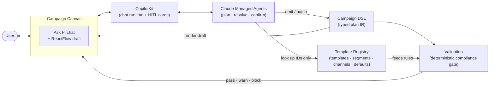
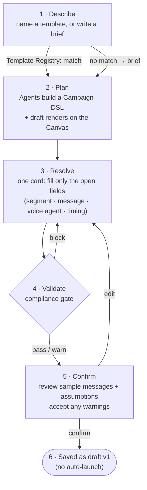

# Ask Pi — Create Campaign Flow

> Implementation reference for the "Ask Pi" conversational campaign-creation feature on the
> campaign canvas (`/campaigns/new`). Covers both delivery paths, the user flow, the component
> map, the data contracts, and the non-negotiable invariants.

---

## 1. What it does

"Ask Pi" lets a user create a campaign **by conversation** instead of dragging nodes. Two entry
intents are supported:

| Story | Entry | Example | Outcome |
|-------|-------|---------|---------|
| **A1 — From template** | Name an approved campaign template | `pre_due_emi_reminder_v3` | Pi instantiates it, pre-fills tenant defaults, asks only for the template's open variables, validates, saves draft v1 |
| **A2 — From brief** | Describe the campaign in plain language | "Recover abandoned carts from the last 48h on WhatsApp, SMS fallback" | Pi confirms channels, plans the journey, surfaces assumptions, batches gaps into one Resolve card, validates, saves draft v1 |

Both render the draft on the **existing ReactFlow canvas**, surface every assumed value, and end at
**"Saved as draft v1"** — there is **no auto-launch** (launch stays a separate manual step).

---

## 2. Two implementations (same UX contract)

There are **two parallel engines** behind the same `AiComposer` shell, selected by a `mode` prop.
They produce the same canvas plan, the same Resolve/Confirm cards, and the same validation outcome.

| | Deterministic path | LLM-agent path |
|---|---|---|
| **`AiComposer mode=`** | `"wizard"` | `"chat"` |
| **Engine** | `AskPiConversation.tsx` (local state machine) | `<CopilotChat>` + `useCampaignAgentActions.tsx` |
| **Data + logic** | `tenant-registry.ts` | `@/lib/campaign/*` (registry, compiler, validation, dsl) projecting `tenant-registry.ts` |
| **LLM / network** | None — fully offline | Anthropic via CopilotKit runtime |
| **Cost** | Free | Requires Anthropic credits |
| **Use when** | Demos, no-key environments, deterministic flows | Natural-language planning, fuzzy briefs |

> **The two paths share one source of truth.** All tenant data and all compliance rules live in
> `tenant-registry.ts`. The agent path is a thin, zod-validated projection of it. Switching `mode`
> changes *how intent is captured*, never *what is allowed* or *how it renders/validates*.

The **current build runs `mode="wizard"`** (set in `WorkflowCanvas.tsx`).

---

## 3. Architecture diagram

Core service components only — how a conversation becomes a campaign draft.



How to read it:

- **Campaign Canvas** — the existing ReactFlow workspace plus the Ask Pi chat surface. The user only
  ever talks here; the draft is drawn here.
- **CopilotKit** — the chat runtime and human-in-the-loop card layer. It carries the user's intent to
  the agents and renders the Resolve / Confirm cards back.
- **Claude Managed Agents** — turn intent into a plan. They orchestrate: look up resources, emit the
  DSL, drive the Resolve/Confirm steps. They **never** invent IDs and **never** see PII.
- **Template Registry** — the single source of selectable resources (campaign templates, segments,
  WhatsApp templates, voice agents, tenant defaults). The agents' only ID source; also feeds the
  compliance rules.
- **Campaign DSL** — the typed intermediate plan the agents produce and patch. It compiles to the
  canvas graph and is the input to validation.
- **Validation** — the deterministic, never-LLM compliance gate (`pass` / `warn` / `block`) that
  decides whether the draft can be saved.

---

## 4. User flow

Same core components, viewed as the user's journey.



Reading it against the architecture:

| Step | User sees | Core components in play |
|------|-----------|-------------------------|
| 1 · Describe | Types into Ask Pi chat | **Canvas → CopilotKit → Agents**; **Template Registry** matches |
| 2 · Plan | Draft appears on canvas + assumptions listed | **Agents** emit **DSL** → renders on **Canvas** |
| 3 · Resolve | One card with only the missing fields | **CopilotKit** HITL card; picks come from **Template Registry** |
| 4 · Validate | Pass / warning / blocked feedback | **Validation** gate over the **DSL** (deterministic) |
| 5 · Confirm | Sample messages + assumptions to accept | **CopilotKit** HITL card over the final **DSL** |
| 6 · Saved | "Saved as draft v1" toast | **DSL** persisted as draft; status stays `draft` |

### Phase reference (`AskPiConversation.ConversationPhase`)

| Phase | Progress | What happens |
|-------|----------|--------------|
| `intent` | 8% | Textarea + entry chips. `handleIntentSubmit` → `matchTemplate(text)` routes A1 vs A2. |
| `briefConfirm` | 22% | A2 only. `analyzeBrief` detects channels/fallback/experiment; user confirms. |
| `planning` | 35% | `onSkeleton(buildSkeleton(plan))`, then after ~1.4s `onBuild(plan)`; pre-fills duration defaults; prints assumptions. |
| `resolve` | 55% | One Resolve card with only the open variables. Submit disabled until required vars set. |
| `journey` | 62% | A2 parallel only. Choose A/B test / audience split / broadcast. |
| `splitResolve` | 66% | A2 parallel only. Split attribute + value/percent. |
| `validating` | 72% | `validateResolved(vars, resolved, channels)`. Patches node `config` in place via `applyResolved`/`applySplit`/`applyExperiment`, then `onBuild`. |
| `blocked` | 72% | A `block` result → message + return to `resolve`. |
| `confirm` | 88% | Campaign-review card: sample messages, assumptions, carried `warn` requiring explicit accept. Free-text edits route back to `resolve` via `applyRefinement`. |
| `saved` | 100% | `onSavedDraft("v1")`; panel collapses; status remains `draft`. |

### Refinement (A2, no rebuild)

After the draft is on the canvas, the chat input accepts refinements (e.g. "make the fallback wait
3 hours, not 6"). `applyRefinement(text, plan)` **patches the single `delay` node's config in place
(same node IDs)** and re-validates — it never rebuilds the graph.

---

## 5. Components & responsibilities

| File | Path | Responsibility |
|------|------|----------------|
| **WorkflowCanvas** | `src/components/workflow/WorkflowCanvas.tsx` | Owns the ReactFlow canvas. Mounts `AiComposer` for new campaigns; wires `onWizardSkeleton`/`onWizardBuild`/`onSavedDraft`/`onBuildingChange`; toasts on save; keeps status `draft`. |
| **AiComposer** | `src/components/workflow/AiComposer.tsx` | The floating "Ask Pi" pill/nudge/expand shell. Picks the engine by `mode`. Registers the agent's frontend actions. Maps "is building" to a canvas lock. |
| **AskPiConversation** | `src/components/workflow/AskPiConversation.tsx` | **Deterministic engine.** The phase state machine, routing, plan rendering via callbacks, Resolve/Confirm/Journey cards, refinement. |
| **tenant-registry** | `src/lib/tenant-registry.ts` | **Single source of truth.** Seed data (segments, WA templates, voice agents, defaults, split attributes, templates), plan builders, `analyzeBrief`/`planFromBrief`, `applyResolved/Split/Experiment/Refinement`, and `runChecks`/`validateResolved` (compliance). |
| **AskPiWizard** | `src/components/workflow/AskPiWizard.tsx` | Exports the shared `AskPiPlan` type, `buildSkeleton`, and build-step constants used by both engines. |
| **useCampaignAgentActions** | `src/components/workflow/useCampaignAgentActions.tsx` | **Agent engine surface.** CopilotKit frontend actions (`listCampaignTemplates`, `listSegments`, `listWhatsAppTemplates`, `listVoiceAgents`, `instantiateCampaignTemplate`, `resolveCampaign`, `validateCampaign`, `confirmCampaign`) + the HITL ResolveCard/ConfirmCard. Holds the working `dslRef`. |
| **campaign-dsl** | `src/lib/campaign/campaign-dsl.ts` | The zod-validated `CampaignDSL` IR (steps, flow, resolvable IDs with provenance). Guarantees the agent can never emit a malformed shape or invented ID. |
| **registry** | `src/lib/campaign/registry.ts` | Agent-facing, metadata-only projection of `tenant-registry`. `listTemplates/Segments/WhatsAppTemplates/VoiceAgents` + `instantiateTemplate` (template → `CampaignDSL`). The **only** source of selectable IDs. |
| **compiler** | `src/lib/campaign/compiler.ts` | Deterministic `CampaignDSL` → ReactFlow plan + `needsInput` (drives Resolve card) + `assumptions`. `applyResolved` folds Resolve answers back into the DSL (stable node IDs). |
| **validation** | `src/lib/campaign/validation.ts` | Thin adapter that projects a `CampaignDSL` into the inputs `runChecks` expects, so both paths validate identically. |
| **runtime.server** | `src/lib/copilot/runtime.server.ts` | CopilotKit runtime + `AnthropicAdapter`. (No-key fallback uses an offline agent.) |

---

## 6. Data contracts

### Campaign DSL (agent path IR) — `campaign-dsl.ts`

```ts
CampaignDSL = {
  version: 1
  name, objective, tenant: string
  source: { kind: "template" | "brief"; templateId?: string }
  audience: { segment: ResolvableId }
  flow: "sequence" | "fallback" | "parallel" | "experiment"
  channels: ("whatsapp" | "voice")[]          // ≥ 1
  steps: Step[]                                 // WhatsAppStep | VoiceStep | DelayStep
  assumptions: string[]                         // tenant defaults, surfaced never asked
}

ResolvableId = { value: string; origin: FieldOrigin; kind: "segment"|"waTemplate"|"voiceAgent" }
FieldOrigin  = "default" | "inferred" | "must-confirm" | "resolved"
```

Provenance drives the UX:
- `default` → baked tenant default → shown as an **assumption**, never asked.
- `inferred` → derived from brief/template wording.
- `must-confirm` → an **open variable** → appears in the Resolve card.
- `resolved` → user picked a real registry ID.

Node IDs are stable (`audience` / `wa` / `voice` / `delay`) so a refinement patches one node.

### Open-variable spec (Resolve card) — `tenant-registry.TemplateVar`

A discriminated union by `kind`: `segment | waTemplate | voiceAgent | smsSender | duration |
splitAttribute | threshold | splitValue | percent`. The Resolve card renders a registry-backed
`Select` for resource kinds (only real/approved IDs; `pending_reapproval` shown with a warn lozenge
but selectable) and an `Input` for `duration/threshold/percent`.

### Validation result — `tenant-registry.ValidationResult`

```ts
ValidationLevel = "pass" | "warn" | "block"
ValidationResult = { level: ValidationLevel; checks: ValidationCheck[]; messages: string[] }
```

`runChecks` (the single rule set) covers: audience segment present; per-channel resource + opt-in
(WA template approval, voice agent live); fallback timing; channel sequence; A/B & audience split;
sending window / DND (no 9pm–9am); frequency cap. Gate mapping: **block → back to Resolve**;
**warn → carried to Confirm for explicit acceptance**; **pass → save**.

---

## 7. Seed data (tenant-registry)

| Set | Count | Notes |
|-----|-------|-------|
| `SEGMENTS` | 5 | e.g. `seg_emi_predue_3d` — "EMI due in 3 days · Suryoday SFB · 8,210" |
| `WA_TEMPLATES` | 4 | one is `pending_reapproval` (`wa_cart_recovery_v3`) → drives the A2 warn |
| `VOICE_AGENTS` | 3 | all `live` (non-live agents are never bindable) |
| `CAMPAIGN_TEMPLATES` | 3 | `pre_due_emi_reminder_v3` (Suryoday SFB), `abandoned_cart_recovery_v2` (StyleZen), `dormant_reactivation_v1` |
| `TENANT_DEFAULTS` | — | sending window 10:00–19:00 IST, freq cap 2/week, sender `+91 98100 12345 · PiCommerce` |
| `SPLIT_ATTRIBUTES` | 7 | for A2 audience/A-B splits |

`Channel` in this workspace is `"whatsapp" | "voice"` only; SMS/Email/Push/RCS are
detected-but-unavailable in `analyzeBrief`.

---

## 8. Non-negotiable invariants (carry into any rebuild)

1. **No invented IDs.** Every selectable resource originates from a registry lookup. The agent path
   enforces this with zod-validated DSL on the way out of each tool call.
2. **No PII in model context.** Registry projections are metadata + IDs only — no phone numbers, no
   contact rows.
3. **Compliance is deterministic.** Validation is `runChecks`, never the LLM. Both paths call the
   same rules.
4. **One batched Resolve card.** Gaps are collected and asked once, not field-by-field.
5. **Tenant defaults are surfaced, never asked.** They appear as assumptions.
6. **Refinements patch, never rebuild.** Stable node IDs; one node's config changes.
7. **Result is a versioned draft.** Ends at "Saved as draft v1", status stays `draft`,
   **no auto-launch**.

---

## 9. Where to start (implementation checklist)

- [ ] Mount `AiComposer` in the canvas for `isNew`; wire the three callbacks + building lock.
- [ ] Seed `tenant-registry.ts` (data + `runChecks`) — the single source of truth.
- [ ] Build the chosen engine:
  - Deterministic → `AskPiConversation.tsx` phase machine + plan builders.
  - Agent → `campaign-dsl.ts` (IR) → `registry.ts` (`instantiateTemplate`) → `compiler.ts`
    (`compile`/`applyResolved`) → `validation.ts` (`validate`) → `useCampaignAgentActions.tsx`
    (frontend actions + HITL cards) → `runtime.server.ts`.
- [ ] Render Resolve (registry-backed pickers) and Confirm (sample messages + assumptions + warn
  acceptance) cards.
- [ ] Gate on validation: block → Resolve, warn → Confirm, pass → save draft v1.

> **Runtime note (agent path only):** CopilotKit 1.61's `AnthropicAdapter` copies the SDK client's
> `baseURL` verbatim and the default lacks `/v1`, so requests 404. Construct the client with an
> explicit base URL: `new Anthropic({ apiKey, baseURL: "https://api.anthropic.com/v1" })`.
